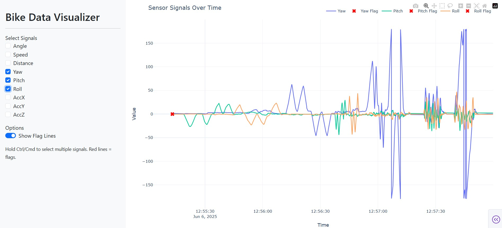

# BicycleDataLogger

**BicycleDataLogger** is an open-source, plug-and-play Arduino-based system for gathering movement and orientation data on bicycles and other mobile platforms. Designed for scalability and field deployment, it automatically detects connected sensors and starts logging data with minimal setup.


## Use cases

- Bicycle dynamics studies
- Vibration and terrain response logging
- Real-world behavioral tracking (e.g., Baby Vibrations Project)
- Portable multi-sensor logging in other mobile scenarios

## Features

- Plug-and-play with auto-detected sensors
- Supports two operation modes:
  - **Standard Mode** (BNO055, RTC, Hall sensor)
  - **High-Vibration Mode** (MPU6050 only)
- Two-button interface for control and calibration
- LED feedback system:
  - Blue = waiting for calibration
  - Red = idle but powered
  - Green = actively measuring
  - Green flash = event flag
  - Blue flash = steering yaw reset
- Logs CSV data to SD card with:
  - Timestamps
  - Orientation
  - Speed
  - Steering angle
  - Flags
  - Optional: Temperature or other sensor data
- Main and secondary housings connected via cable for modularity

## Hardware

- Arduino Nano ESP32
- BNO055 IMUs ×2 (for orientation and steering)
- MPU6050 (for high-frequency vibration)
- DS3231 RTC module
- Hall-effect speed sensor
- SD card module
- LED (RGB)
- 2× Push buttons (start/stop and flag/reset)
- DuPont pin connectors
- Wires
- USB power bank
- Bicycle-mountable main + secondary housings


## Expandability

We encourage contributors to expand the BicycleDataLogger! You can:

- Add support for new I²C or SPI sensors
- Create new operational modes based on connected sensor combinations
- Extend the data logging format to include additional fields (e.g., temperature, vibration frequency)

The current structure supports automatic sensor detection for a core set of devices, and it's straightforward to modify the logic for additional use cases.

## Modes

| Mode               | Trigger                              | Behavior |
|--------------------|--------------------------------------|----------|
| **Standard Mode**   | BNO055s connected                    | 100 Hz logging of orientation, speed, steering |
| **Vibration Mode**  | Only MPU connected, no BNO055        | 400 Hz logging of acceleration + 100 Hz other data |

## User interface

| Button             | Action                                             |
|--------------------|----------------------------------------------------|
| Main (on housing)  | Toggle start/stop logging                         |
| Secondary (on fork)| Press = flag event<br>Hold 5s = recalibrate yaw   |

## Data Logging

- Data is saved to `/Regular.csv` or `/Vibrations.csv` on the SD card depending on mode
- One large file per deployment (appends between sessions)
- Timestamped rows with data fields based on connected sensors
- Compatible with Excel, Python, R, and analysis pipelines

## Getting Started

### 1. 3D-print Housing and cut out backbone

- **Downloadable SolidWorks Files** for the 3D-printable and electrical backbone for the main and the secondary housing & the concept housing for baby vibrations. 
The 3D-prints can be made with any filament and the backbone is designed for a 4mm thick 4mm acrylglas which can be lasercut.
  ➤ [Download Housing Files (.zip)](./SolidWorks_Housing.zip)


### 2. Connect hardware

Wire up supported sensors on a breadboard, prototyping board or PCB following the wiring scheme:


We made use of DuPont connections to make the sensor connection easily interchangable. Sensors can be run to I²C or SPI connectors. I²C adresses can be changed by connecting the AD0 wire (HIGH) or leaving it unconnected (LOW) (Green wiring in image). The connectors can be seen below.


### 3. Flash Firmware

Upload `src/main.ino` to your Arduino Nano ESP32 using Arduino IDE


### 4. Calibrate & deploy

- Power the logger via USB power bank
- Wait for the blue LED (calibration mode)
- Calibrate the logger (and reset steering angle)
- Start logging using the button
- Flag significant events
- Retrieve the SD card after deployment

**A Quick Guide for the LED indicator and two buttons can be printed on the main housing**


  ➤ [Download Quick Guide (.jpg)](/images/QuickGuide.jpg)


## Data visualization tool (Interactive)

You can visualize logged data interactively using the included Dash application built with Plotly.



### How to use

1. Make sure you have Python installed (version 3.7+).
2. Install dependencies:
   ```bash
   pip install pandas numpy dash dash-bootstrap-components plotly
3. Place your data CSV (e.g., `Regular.csv`) in the same directory as `DataVisualization.py` and rename it: `Data.csv`
3. Run `DataVisualization.py`
4. Open the application in your browser at http://127.0.0.1:8050/

(An example data file where yaw pitch and roll were tested is included in the files: `Data.csv`. You can test the visualization tool with it and replace it with your own data when needed)


## For researchers

You can build multiple units and send them to test users. Data can be collected offline via SD cards and analyzed centrally. No live monitoring is needed once deployed.

## Customization

- Add more sensors by modifying `src/main.ino` and logging logic
- Create new modes or detection rules based on sensors present
- Expand CSV logging format as needed

## Licenses

This project is licensed under the MIT License. See [LICENSE](./LICENSE) for details.  
Third-party libraries used are listed in [THIRD_PARTY_LICENSES.md](./THIRD_PARTY_LICENSES.md).

## Acknowledgments

Thanks to the Arduino, Adafruit, and open-source communities. Special thanks to the Baby Vibrations Project for helping shape the modular sensor concept.